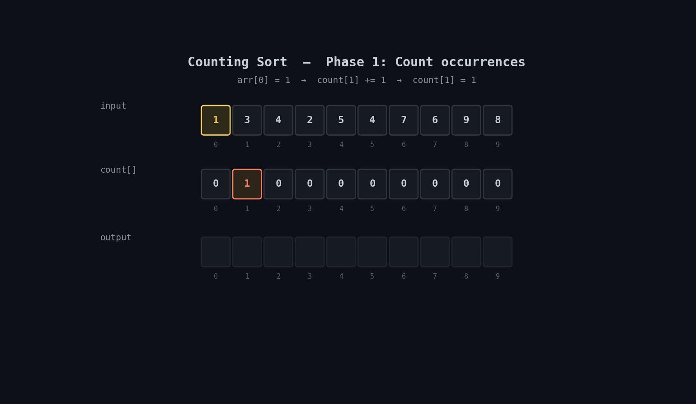

<h1 align="center">🔢 Counting Sort</h1>

<p align="center">
  <i>An animated, beginner-friendly walkthrough of the Counting Sort algorithm with a clean Python implementation.</i>
</p>

<p align="center">
  
  
  
</p>

---

## 📽️ Visual Walkthrough

Counting Sort doesn't compare elements at all — it counts **how many times each value appears**, turns those counts into positions, and places every element directly into its final spot. That's what makes it faster than `O(n log n)` comparison sorts, with a catch: it only works well when values fall in a small, known range.

<p align="center">
  
</p>

> 🟡 Amber = input element being read · 🟠 Orange = count[] cell being updated · 🔵 Blue = previous cumulative value · 🟢 Green = output cell placed / fully sorted

---

## ⚙️ How It Works

1. **Count**: for every value in the input, increment `count[value]`.
2. **Accumulate**: turn `count[]` into a running total, so `count[v]` now means "how many values are `≤ v`".
3. **Place**: walk the input **from right to left** (this is what keeps equal elements in their original relative order — i.e. keeps the sort stable). For each value, look up `count[value]`, place it at `output[count[value] - 1]`, then decrement `count[value]`.

---

## ⏱️ Complexity

| Case | Time | Space |
|---|---|---|
| Best / Average / Worst | `O(n + k)` | `O(n + k)` |

Where `n` is the number of elements and `k` is the range of input values (`max_value + 1` here). This is **faster than any comparison-based sort** when `k` isn't much bigger than `n` — but if the values are huge or sparse (e.g. one value near a million), the `count[]` array becomes wastefully large. Counting Sort trades comparisons for memory.

---

## 🐍 Implementation

```python
def counting_sort(arr):
    n = len(arr)
    if n == 0:
        return arr
    max_value = max(arr)
    count = [0] * (max_value + 1)
    output = [0] * n

    for i in range(n):
        count[arr[i]] += 1

    for i in range(1, max_value + 1):
        count[i] += count[i - 1]

    for i in range(n - 1, -1, -1):
        output[count[arr[i]] - 1] = arr[i]
        count[arr[i]] -= 1

    return output


num = [1, 3, 4, 2, 5, 4, 7, 6, 9, 8]
print(counting_sort(num))
```

> 💡 Full file: [`counting_sort.py`](./counting_sort.py)

---

## ▶️ Run It

```bash
git clone https://github.com/zain-cs/12-Counting-Sort.git
cd 12-Counting-Sort
python counting_sort.py
```

---

## 🔁 Counting Sort vs. Comparison-Based Sorts

| | Merge / Quick Sort | Counting Sort |
|---|---|---|
| Strategy | Compare elements | Count occurrences, no comparisons |
| Time complexity | `O(n log n)` | `O(n + k)` |
| Works on any data? | ✅ Yes (anything orderable) | ❌ Needs integer (or integer-mappable) keys in a known range |
| Stable? | Merge Sort: ✅, Quick Sort: ❌ | ✅ Yes (thanks to the right-to-left placement pass) |

Counting Sort is the building block behind **Radix Sort**, which sorts numbers digit-by-digit using Counting Sort as its inner step — a natural next algorithm to explore after this one.

---

## 🗺️ Part of a DSA Series

📌 [Linear Search](https://github.com/zain-cs/1-Linear-Search) → [Binary Search](https://github.com/zain-cs/2-Binary-Search) → [Ternary Search](https://github.com/zain-cs/3-Ternary-Search) → [Jump Search](https://github.com/zain-cs/4-Jump-Search) → [Exponential Search](https://github.com/zain-cs/5-Exponential-Search) → [Bubble Sort](https://github.com/zain-cs/6-Bubble-Sort) → [Selection Sort](https://github.com/zain-cs/7-Selection-Sort) → [Insertion Sort](https://github.com/zain-cs/8-Insertion-Sort) → [Merge Sort](https://github.com/zain-cs/9-Merge-Sort) → [Quick Sort](https://github.com/zain-cs/10-Quick-Sort) → [Shell Sort](https://github.com/zain-cs/11-Shell-Sort) → **Counting Sort** → more to come as I work through DSA.

---

<p align="center">
  Made with 🐍 by <a href="https://github.com/zain-cs">Muhammad Zain Ul Abidin</a>
</p>
